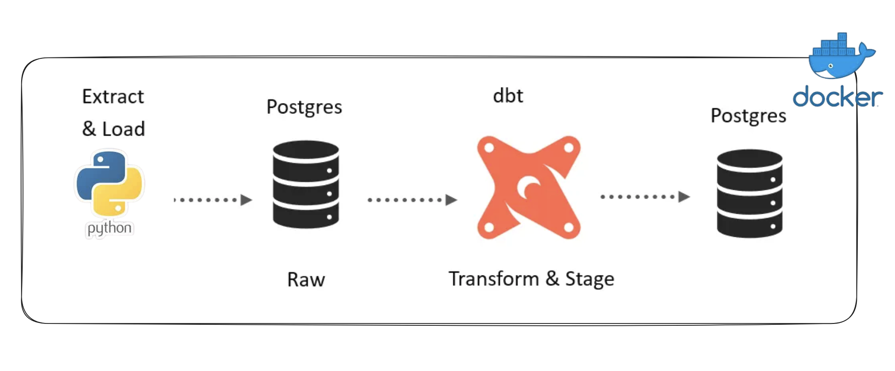
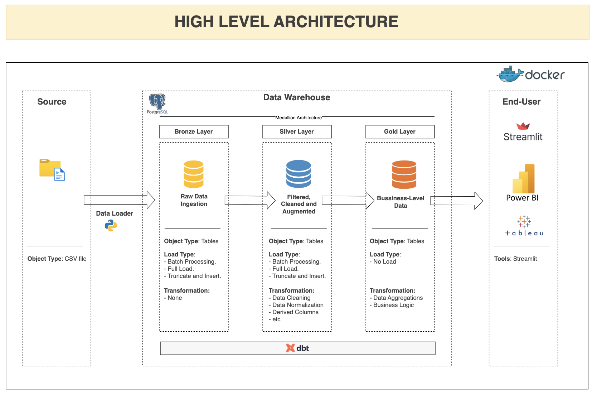
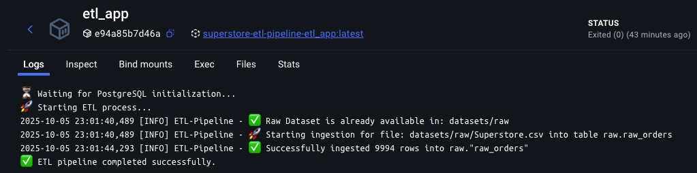
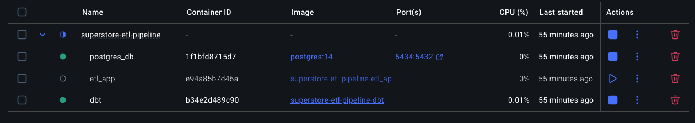

# Modern Data Pipeline with dbt, Postgresql and Docker. 



This project implements a **modern data analytics pipeline** for the *Superstore Sales* dataset using **PostgreSQL**, **dbt**, **Docker**, and **Power BI**, following the **Medallion Architecture (Bronze → Silver → Gold)** pattern.

## 📚 Table of Contents
1. [ 🗂️ Project Overview](#️-project-overview)
2. [🏗️ Data Flow Architecture](#1-️-data-flow-architecture)  
3. [🐍 Python ETL Setup](#2-python-etl-setup)  
4. [🐘 Postgres Setup](#3--postgres-setup)  
5. [🧠 DBT Setup](#4--dbt-setup)  
6. [🐳 Orchestration: Dockerized Architecture](#5--ochestration-dockerized-architecture)  
7. [🧪 Testing and Validation](#6--testing-and-validation)  
8. [🚀 Deployment: Push and Release Docker Images](#7--deployment-push-and-release-docker-images)  
9. [📊 Visualization and Report (Streamlit)](#8--visualization-and-report-streamlit)


## 🗂️ Project Overview

### 🎯 Objective
To design a fully containerized ETL + Analytics solution that:
- Ingests raw CSV sales data.
- Cleans, transforms, and models it with dbt.
- Exposes clean analytical models for reporting.

**Tools Used:**
- Python for ETL and data ingestion  
- PostgreSQL as the warehouse  
- dbt for data transformation and modeling  
- Docker for containerization  
- Streamlit for reporting and visualization  

## 1. 🏗️ Data Flow Architecture



| Layer | Description | Tools/Tasks |
|-------|--------------|-------------|
| **Source** | CSV file containing raw Superstore data | Local file / S3 upload |
| **Bronze Layer (Raw Data)** | Raw data ingested into PostgreSQL without transformation | Python Loader Script |
| **Silver Layer (Staging)** | Data cleaning, normalization, derived columns | dbt models (`stg_`) |
| **Gold Layer (Business Models)** | Aggregated and business-ready data for analytics | dbt models (`mart_`) |
| **End-User Layer** | Dashboard visualization and KPI reporting | Power BI |


## 2. Python ETL Setup
The Python ETL handles:
- Data extraction from via [kagglehub API](https://www.kaggle.com/docs/api)
- Cleaning and formatting (dates, numbers, text fields, etc.)  
- Loading into the `raw` schema of PostgreSQL  

**Run the ETL locally:**
```bash
python3 etl/main.py
```

**Environment variables**:
```bash
# Your Database connection parameters
DATABASE_NAME="<your-database-name>"
DATABASE_USER="<your-database-user>"
DATABASE_PASSWORD="<your-database-password>"
DATABASE_HOST="<your-host>" # `localhost` for local setup
PORT=5432
```

**Ouput**


## 3. 🐘 Postgres Setup

The PostgreSQL database acts as the central warehouse. A Postgres docker image was used.


## 4. 🧠 DBT Setup

`dbt` is used for data modeling, transformations, and documentation.

**⚙️ Setup Steps**
1. Intialize dbt project
```bash
dbt init --project-name dbt_store
```

2. dbt will automatically create the project structure and use the configuration defined in:

    - `dbt_project.yml` — manages your project settings and models.

    - `profiles.yml` — stores connection credentials and environment configurations.

3. Once configured, you can run transformations using:
```bash
dbt deps
dbt build --profiles-dir /root/.dbt
```

4. After a successful build, explore dbt documentation locally with:
```bash
dbt docs generate
dbt docs serve
```


## 5. 🐳 Ochestration: Dockerized Architecture

All components run inside **Docker containers** for easy setup and portability.

### Services:
- **PostgreSQL** → Data warehouse backend  
- **dbt** → Transformation and data modeling  
- **pgadmin** *(optional)* → Database admin GUI  
- **Power BI** → Consumes data from `gold` layer 

Build Image

```bash
docker-compose up --build -d
docker-compose down -v
```

**Ouput**


## 6. 🧪 Testing and Validation

Before deployment, test:

- ✅ Data quality using dbt tests
- ✅ Pipeline connectivity (Python → Postgres → dbt → Streamlit)
- ✅ Docker build and run consistency

**Run dbt tests**:
```bash
dbt test --profiles-dir /root/.dbt
```

## 7. 🚀 Deployment: Push and Release Docker Images

To automate the release process, you can use the provided shell [`./scripts/push_images.sh`](./scripts/push_images.sh) to push all built Docker images to your Docker Hub repository.

To Run the script to push your images:
```bash
chmod +x ./scripts/push_images.sh
./scripts/push_images.sh
```
This ensures that all your Docker images are properly tagged and pushed to Docker Hub, allowing anyone to pull and run them without rebuilding locally.


## 8. 📊 Visualization and Report (Streamlit)

The Streamlit dashboard visualizes your mart data for reporting and analytics.

Run Streamlit app:
```bash
streamlit run streamlit/app.py
```

**Example insights**:

- Total Sales by Year and Region
- Average Sales per Order
- Category-level performance

**Dashboard Preview**:


## 📚 Summary

This setup provides a fully automated data pipeline with:

- Reproducible transformations (dbt)
- Automated deployments (Docker)
- Visual reporting (Streamlit)
- Scalable architecture (modular and layered)