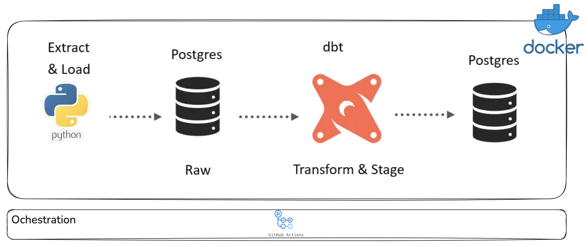
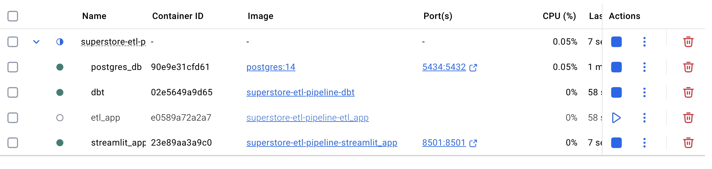
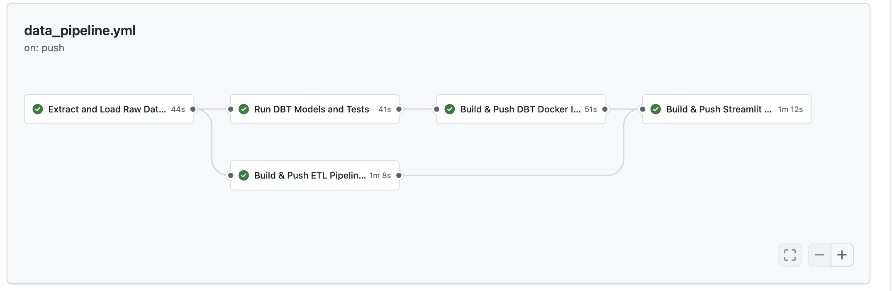

# Modern Data Pipeline with dbt, Postgresql and Docker. 



This project implements a **modern data analytics pipeline** for the *Superstore Sales* dataset using **PostgreSQL**, **dbt**, **Docker**, and **Power BI**, following the **Medallion Architecture (Bronze → Silver → Gold)** pattern.

## 📚 Table of Contents
1. [ 🗂️ Project Overview](#️-project-overview)
2. [🏗️ Data Flow Architecture](#1-️-data-flow-architecture)  
3. [🐍 Python ETL Setup](#2-python-etl-setup)  
4. [🐘 Postgres Setup](#3--postgres-setup)  
5. [🧠 DBT Setup](#4--dbt-setup)  
6. [🐳 Orchestration: Dockerized Architecture](#5--ochestration-dockerized-architecture)  
7. [🧪 Testing and Validation](#6--testing-and-validation)  
8. [🚀 Deployment: Push and Release Docker Images](#7--deployment-build-and-push-docker-images-via-github-actions)  
9. [📊 Visualization and Report (Streamlit)](#8--visualization-and-report-streamlit)


## 🗂️ Project Overview

### 🎯 Objective
To design a fully containerized ETL + Analytics solution that:
- Ingests raw CSV sales data.
- Cleans, transforms, and models it with dbt.
- Exposes clean analytical models for reporting.

**Tools Used:**
- Python for ETL and data ingestion  
- PostgreSQL as the warehouse  
- dbt for data transformation and modeling  
- Docker for containerization  
- Streamlit for reporting and visualization  

## 1. 🏗️ Data Flow Architecture


| Layer | Description | Tools/Tasks |
|-------|--------------|-------------|
| **Source** | CSV file containing raw Superstore data | Local file / S3 upload |
| **Bronze Layer (Raw Data)** | Raw data ingested into PostgreSQL without transformation | Python Loader Script |
| **Silver Layer (Staging)** | Data cleaning, normalization, derived columns | dbt models (`stg_`) |
| **Gold Layer (Business Models)** | Aggregated and business-ready data for analytics | dbt models (`mart_`) |
| **End-User Layer** | Dashboard visualization and KPI reporting | Power BI |


## 2. Python ETL Setup
The Python ETL handles:
- Data extraction from via [kagglehub API](https://www.kaggle.com/docs/api)
- Cleaning and formatting (dates, numbers, text fields, etc.)  
- Loading into the `raw` schema of PostgreSQL  

**Run the ETL locally:**
```bash
python3 etl/main.py
```

**Environment variables**:
```bash
# Your Database connection parameters
DATABASE_NAME="<your-database-name>"
DATABASE_USER="<your-database-user>"
DATABASE_PASSWORD="<your-database-password>"
DATABASE_HOST="<your-host>" # `localhost` for local setup
PORT=5432
```

**Ouput**


## 3. 🐘 Postgres Setup

The PostgreSQL database acts as the central warehouse. A Postgres docker image was used.


## 4. 🧠 DBT Setup

`dbt` is used for data modeling, transformations, and documentation.
```bash
services:
   
    postgres_db:
        image: postgres:14
        container_name: postgres_db
        environment:
            POSTGRES_USER: ${DATABASE_USER}
            POSTGRES_PASSWORD: ${DATABASE_PASSWORD}
            POSTGRES_DB: ${DATABASE_NAME}
        volumes:
            - ./scripts/pg_init.sql:/docker-entrypoint-initdb.d/pg_init.sql
        ports:
            - "5434:5432"
        healthcheck:
            test: ["CMD-SHELL", "pg_isready -U ${DATABASE_USER} -d ${DATABASE_NAME}"]
            interval: 5s
            timeout: 5s
            retries: 5
            start_period: 10s
```
**⚙️ Setup Steps**
1. Intialize dbt project
```bash
dbt init --project-name dbt_store
```

2. dbt will automatically create the project structure and use the configuration defined in:

    - `dbt_project.yml` — manages your project settings and models.

    - `profiles.yml` — stores connection credentials and environment configurations.

3. Once configured, you can run transformations using:
```bash
dbt deps
dbt build --profiles-dir /root/.dbt
```

4. After a successful build, explore dbt documentation locally with:
```bash
dbt docs generate
dbt docs serve
```


## 5. 🐳 Ochestration: Dockerized Architecture

All components run inside **Docker containers** for easy setup and portability.

### Services:
- **PostgreSQL** → Data warehouse backend  
- **dbt** → Transformation and data modeling  
- **pgadmin** *(optional)* → Database admin GUI  
- **Power BI** → Consumes data from `gold` layer 

Build Image

```bash
docker-compose up --build -d
docker-compose down -v
```

**Ouput**


## 6. 🧪 Testing and Validation

Before deployment, test:

- ✅ Data quality using dbt tests
- ✅ Pipeline connectivity (Python → Postgres → dbt → Streamlit)
- ✅ Docker build and run consistency

**Run dbt tests**:
```bash
dbt debug
dbt deps
dbt test --profiles-dir /root/.dbt
dbt run
```

## 7. 🚀 Deployment: Build and Push Docker Images via GitHub Actions



To streamline the deployment process, this project uses GitHub Actions to automatically test the `etl` and `dbt` process after which it build and push Docker images to your Docker Hub repository whenever changes are pushed to the `main` branch.

**⚡ Workflow Triggers**

The workflow runs automatically based on three triggers:
1. **Push to the main branch** — whenever new changes are merged or committed to main.
2. **Manual trigger** — can be executed directly from the Actions tab in GitHub for on-demand builds.
3. **Scheduled trigger (CRON)** — runs every day at 12:00 AM UTC to build and push the latest image.

**Secrets**

Before using this automation, make sure you’ve added the following repository secrets in your GitHub project settings:

- DOCKERHUB_USERNAME → your Docker Hub username
- DOCKERHUB_TOKEN → a Docker Hub personal access token for authentication
- DATABASE_USER → postgesql database username
- DATABASE_PASSWORD → postgesql database password
- DATABASE_NAME → postgesql database name

Once your GitHub secrets are properly configured, the workflow will:

1. Build the ETL and DBT Docker image from the [./docker/etl/Dockerfile](./docker/etl/Dockerfile) and [./docker/dbt/Dockerfile](./docker/dbt/Dockerfile).
2. Tag it with:
    - latest (for the most recent build)
    - The Git commit SHA (for traceability)
3. Push both tags to your Docker Hub account.


### 🧩 How It Works

- The workflow is triggered to test the ETL pipeline by extracting and loading raw datasets into the PostgreSQL database.
- It runs both the ETL and DBT processes in parallel, ensuring that data transformation and quality checks are validated together.
- Once the ETL test pipeline completes successfully, the workflow proceeds to build and tag your ETL Docker image for versioning and traceability, and then pushes it to your Docker Hub repository.
- The DBT test pipeline also runs in parallel to confirm that all models and tests pass successfully.


## 8. 📊 Visualization and Report (Streamlit)

The Streamlit dashboard visualizes your mart data for reporting and analytics.

Run Streamlit app:
```bash
streamlit run streamlit/app.py
```

**Example insights**:

- Total Sales by Year and Region
- Average Sales per Order
- Category-level performance

**Dashboard Preview**:


## 📚 Summary

This setup provides a fully automated data pipeline with:

- Reproducible transformations (dbt)
- Automated deployments (Docker)
- Visual reporting (Streamlit)
- Scalable architecture (modular and layered)